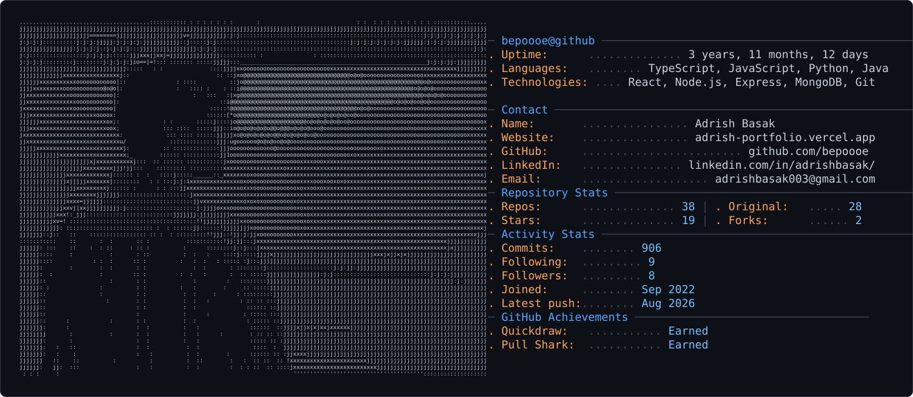

  <h2 style="margin-bottom:8px; color:#c9d1d9; font-family:'Consolas','Menlo','DejaVu Sans Mono',monospace; letter-spacing:2px;">bepoooe@github:~$ ./intro</h2>
  
building ideas, one commit at a time.

  <picture>
    <source media="(prefers-color-scheme: dark)" srcset="dark_mode.svg" />
    <source media="(prefers-color-scheme: light)" srcset="light_mode.svg" />
    
  </picture>

---

  <table border="0" width="100%" cellspacing="0" cellpadding="0">
    <tr>
      <td align="center">
        

          
        

      </td>
    </tr>
  </table>

---

  <table border="0" width="100%" cellspacing="0" cellpadding="10">
    <tr>
      <td width="50%" valign="top" align="center">
        
      </td>
      <td width="50%" valign="top" align="center">
        
      </td>
    </tr>
    <tr>
      <td colspan="2" align="center">
        
      </td>
    </tr>
  </table>

