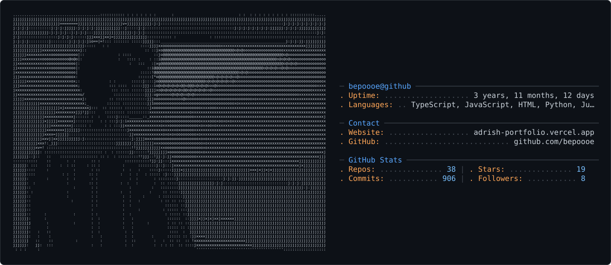

  

---

  <table border="0" width="100%" cellspacing="0" cellpadding="0">
    <tr>
      <td align="center">
        

          
        

      </td>
    </tr>
  </table>

---

  

    <pre style="margin:0; white-space:pre-wrap; color:#c9d1d9; font-family:'Consolas', 'Menlo', 'DejaVu Sans Mono', monospace; font-size:15px; line-height:1.7;">
────────────────────────────────────────
  // JOKE OF THE DAY
────────────────────────────────────────
Why do programmers prefer dark mode?
Because light attracts bugs.
────────────────────────────────────────
    </pre>
  

